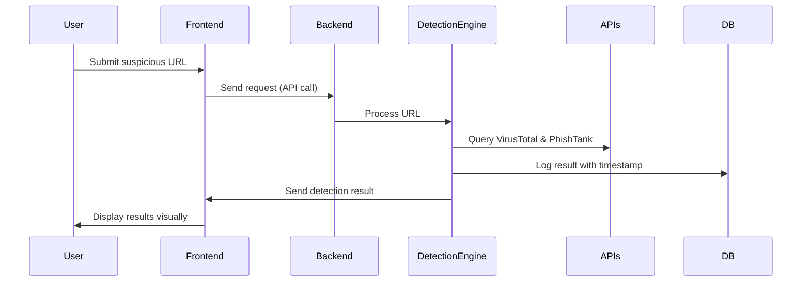

# 🛡️ PHISHGUARD AI 2.0

**PHISHGUARD AI** is an advanced **AI-powered phishing detection system** designed to protect users from phishing attacks by analyzing URLs and detecting malicious websites.  
It integrates **AI/ML models, rule-based heuristics, and external APIs (VirusTotal, PhishTank)** for accurate and real-time detection.  

---

## 🚀 Features
- 🔗 **Phishing URL Detection** – Detects suspicious and fraudulent links.  
- 🧠 **AI + Rule-based Hybrid** – Uses ML models + intelligence APIs for better accuracy.  
- 📊 **Visualization Dashboard** – Interactive React.js UI for clear results.  
- 🗄️ **Database Logging** – Saves results with timestamps in SQLite.  
- 🐳 **Dockerized Deployment** – Simple and scalable deployment with Docker.  
- 🔒 **Secure Configurations** – `.env` file for API keys & secrets.  

---

## 🛠️ Tech Stack
- **Frontend:** React.js  
- **Backend:** Python (Flask/FastAPI)  
- **Database:** SQLite (default) | PostgreSQL/MySQL (optional)  
- **Containerization:** Docker + Docker Compose  
- **External APIs:** VirusTotal, PhishTank  

---

## 📂 Project Structure
```
PHISHGUARDAI/
│── backend/             # Backend (Flask/FastAPI)
│   ├── app.py           # Main server
│   ├── config.py        # Configurations
│   ├── db.py            # Database handler
│   ├── database.db      # SQLite DB
│   ├── requirements.txt # Dependencies
│   └── Dockerfile       # Backend Docker setup
│
│── frontend/            # React.js frontend
│   ├── package.json     # Frontend dependencies
│
│── docker-compose.yml   # Docker Compose config
│── run_backend.py       # Quick backend runner
│── README.md            # Documentation
```

---

## ⚙️ Installation & Setup

### 🔹 Prerequisites
- Install [Docker Desktop](https://www.docker.com/products/docker-desktop)  
- Enable **WSL2** if using Windows (`wsl --install`)  

### 🔹 Download Project

**Option 1 – Clone Repository (Recommended):**
```bash
git clone https://github.com/rajveer-kushwaha/PHISHGUARD-AI.git
cd PHISHGUARDAI
```

**Option 2 – Download as ZIP (GitHub):**
1. Go to the GitHub repository page.  
2. Click on **Code → Download ZIP**.  
3. Extract the ZIP file using:  
   ```bash
   unzip PHISHGUARD-AI-main.zip
   cd PHISHGUARD-AI-main
   ```  

### 🔹 Configure Environment
Create `.env` file inside `backend/`:
```
API_KEY_VIRUSTOTAL=your_api_key_here
API_KEY_PHISHTANK=your_api_key_here
```

### 🔹 Run with Docker (Recommended)
```bash
docker compose up --build
```

### 🔹 Run without Docker
Backend:
```bash
cd backend
pip install -r requirements.txt
python app.py
```
Frontend:
```bash
cd frontend
npm install
npm start
```

---

## 🌐 Access
- **Frontend (Dashboard):** http://localhost:3000  
- **Backend API:** http://localhost:5000  

---

## 📊 System Architecture

```mermaid
flowchart TD
    A[User Input: Suspicious URL] --> B[Frontend (React.js Dashboard)]
    B --> C[Backend (Flask/FastAPI)]
    C --> D[Phishing Detection Engine]
    D --> E[Rule-based Checks]
    D --> F[AI/ML Model]
    D --> G[External Threat APIs (VirusTotal, PhishTank)]
    E --> H[Database Logging (SQLite/PostgreSQL/MySQL)]
    F --> H
    G --> H
    H --> I[Frontend Dashboard Results]
```

---

## 🔒 Security Measures
- Secrets handled via `.env`, not hardcoded.  
- Parameterized SQL queries → protection against SQL Injection.  
- CORS restricted → only frontend allowed.  
- Basic rate limiting → prevents API abuse.  

---

## 🚀 Future Enhancements
- **Email phishing detection** (headers, body, links).  
- **Browser extension** for instant URL checks.  
- **Enterprise monitoring dashboard**.  
- **Cloud DB support** (PostgreSQL/MySQL).  
- **Offline ML detection model** (no API dependency).  

---

## 🖼️ Workflow Overview (High-level)



---

## 👨‍💻 Contributor
- **Rajveer** – Project Developer  

---

## 📜 License
Licensed under the **MIT License**.  
